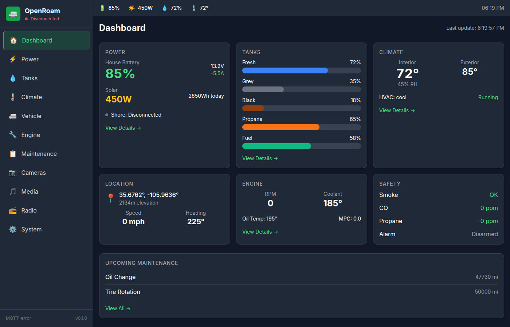
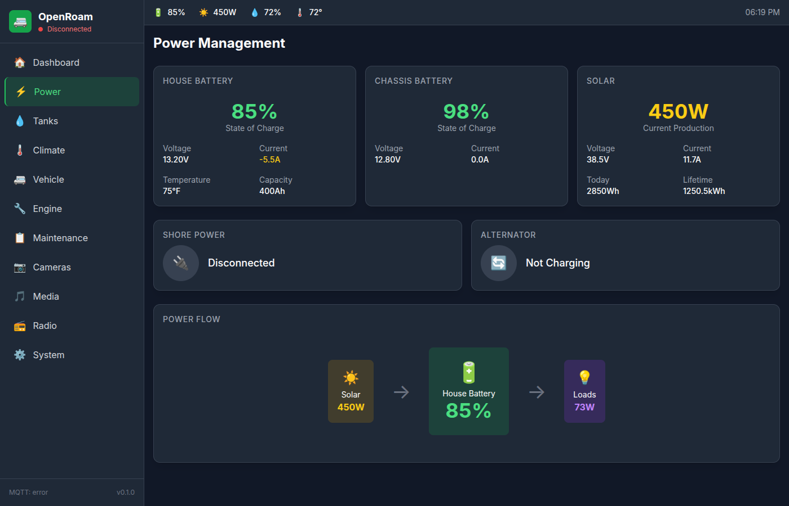
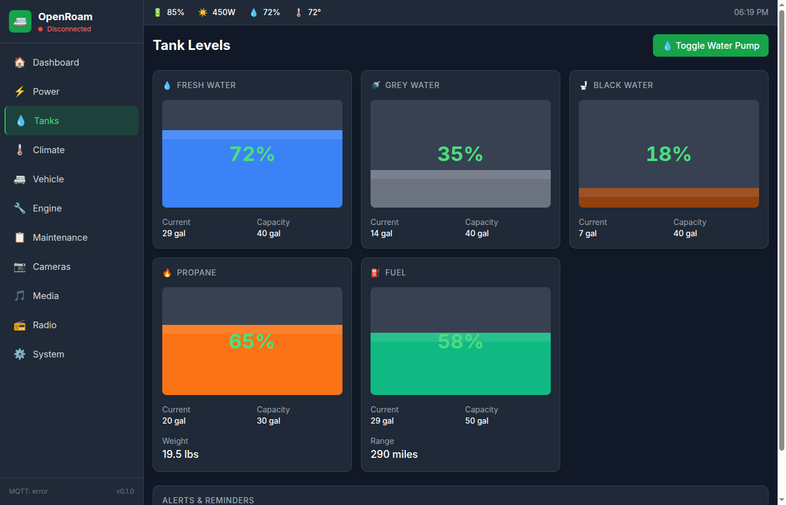

# OpenRoam

**Open-Source Mobile Living Computing Platform**

[](https://opensource.org/licenses/MIT)
[](https://ohwr.org/cern_ohl_s_v2.txt)

OpenRoam is an open-source computing cluster for RVs, schoolies, vans, and all mobile living vehicles. It provides unified monitoring and control of all vehicle systems through a modern web dashboard.

## Screenshots

### Dashboard Overview


### Power Management


### Tank Levels


## Target Vehicles

- Sprinter/Transit/ProMaster vans
- School bus conversions (Schoolies)
- Travel trailers and fifth wheels
- Class A/B/C motorhomes
- Truck campers
- Overlanding vehicles

## System Architecture

OpenRoam uses a 4-node Raspberry Pi cluster with custom HAT modules:

| Node | Hardware | Primary Role |
|------|----------|--------------|
| **Nav Node** | RPi 5 8GB | Dashboard, GPS, vehicle systems, primary control |
| **Net Node** | RPi 4 4GB | WiFi mesh AP, cellular failover, Starlink gateway, VPN |
| **NAS Node** | RPi 4 8GB | Media server, trip photos, dashcam storage, backups |
| **AI Node** | RPi 5 8GB | Camera processing, security detection, backup camera overlay |

## Hardware Modules (~$1100 total system cost)

### Core Cluster HATs
- **Nav HAT** ($85) - Multi-constellation GPS, IMU, compass, I2C sensor bus
- **Power HAT** ($65) - Battery monitoring (4 banks), solar, shore power, Victron VE.Direct
- **Storage HAT** ($55) - PCIe NVMe M.2 slot, USB 3.0 for NAS node
- **AI Carrier** ($65) - Hailo-8L M.2 slot, dual CSI camera inputs

### RV-Specific HATs
- **Tank HAT** ($55) - 6-channel tank sensors, propane, fuel gauge
- **Climate HAT** ($45) - 8-zone temperature, HVAC relay control, diesel heater interface
- **Vehicle HAT** ($75) - Leveling jacks, slide-outs, generator control
- **Safety HAT** ($35) - Smoke/CO/propane detection, security inputs

### Network & Communications
- **Router HAT** ($75) - WiFi 6 AP, mesh networking, VLAN support
- **Cellular Interface** ($85) - LTE Cat-12, dual SIM failover
- **Starlink Interface** ($45) - Dish status, speed monitoring
- **LoRa Mesh HAT** ($55) - Meshtastic-compatible, off-grid messaging

### Radio Communications
- **CB Radio Interface** ($45) - Channel control, S-meter, PTT
- **GMRS Interface** ($35) - GMRS/FRS radio integration
- **Ham Radio Interface** ($65) - CI-V/CAT rig control, digital modes
- **SDR Receiver** ($45) - RTL-SDR, NOAA weather, ADS-B

### Interface Modules
- **Lighting HAT** ($45) - 12-channel PWM LED dimming, scenes
- **Camera Interface** ($65) - 4x MIPI CSI for 360° bird's eye view
- **Audio Interface** ($45) - Bluetooth 5.0, 4-zone audio
- **Engine Monitor HAT** ($65) - OBD-II, J1939 diesel
- **AM/FM Tuner HAT** ($35) - Si4735 receiver, RDS display
- **Dash Display Interface** ($45) - 7" IPS HDMI, touch, auto-brightness
- **Gaming HAT** ($55) - USB controllers, RetroArch optimized

## Dashboard Features

### Navigation & Travel
- GPS location and route planning
- Campground and boondocking finder
- Trip computer with fuel economy stats
- RV-safe routing integration

### Power Management
- Battery state of charge (4 banks)
- Solar production monitoring
- Shore power status
- Alternator charging

### Tank Monitoring
- Fresh/grey/black water levels
- Propane level and usage
- Fuel level and range estimation
- Automatic pump control

### Climate Control
- Multi-zone temperature monitoring
- HVAC and diesel heater control
- Temperature scheduling
- Humidity monitoring

### Vehicle Systems
- Auto-leveling jack control
- Slide-out management
- Generator start/stop
- Engine diagnostics (OBD-II)

### Maintenance Tracking
- Oil life and service reminders
- Tire rotation scheduling
- Filter replacement tracking
- Complete service history

### Media & Entertainment
- Plex/Jellyfin integration
- AM/FM radio with RDS
- Bluetooth audio control
- RetroArch gaming

### Safety & Security
- Smoke/CO/propane monitoring
- Security camera feeds
- Motion detection recording
- Door/window sensors

### Radio Communications
- CB radio control (Ch 9/19)
- GMRS with repeater support
- Ham radio rig control
- LoRa mesh messaging

## External Integrations

### Power Systems
- Victron (VE.Direct, VE.Can)
- Renogy (RS-485, Bluetooth)
- Battle Born (SOC monitoring)
- Magnum/Xantrex inverters

### Climate Systems
- Webasto/Espar diesel heaters
- Chinese diesel heaters
- Dometic RV-C
- Coleman-Mach

### RV Services
- Escapees RV Club
- Harvest Hosts
- iOverlander
- Campendium
- GasBuddy

## Quick Start

### Prerequisites
- 4x Raspberry Pi (2x Pi 5 8GB, 2x Pi 4 4GB/8GB)
- HAT modules for your needs
- 12V power supply
- Ethernet switch (optional)

### Installation

1. Flash the pre-built images:
```bash
# Flash each node's image to SD card
./tools/flash-image.sh nav-node /dev/sdX
./tools/flash-image.sh net-node /dev/sdX
./tools/flash-image.sh nas-node /dev/sdX
./tools/flash-image.sh ai-node /dev/sdX
```

2. Configure your vehicle:
```bash
# Run the setup wizard
./tools/setup-wizard.sh
```

3. Access the dashboard:
```
http://openroam.local
```

## Building from Source

### Dashboard
```bash
cd software/openroam-dashboard
npm install
npm run dev
```

### Python Core Library
```bash
cd software/openroam-core
pip install -e .
```

### Hardware
KiCad 7.0+ files are in `hardware/*/kicad/`

## Data Model (RoamK)

OpenRoam uses RoamK, a JSON data model inspired by Signal K for marine systems:

```json
{
  "vehicle": {
    "location": {"latitude": 35.123, "longitude": -106.456},
    "speed": 65,
    "heading": 180
  },
  "power": {
    "batteries": {
      "house": {"voltage": 13.2, "soc": 85}
    }
  },
  "tanks": {
    "fresh": {"level": 75},
    "grey": {"level": 40}
  }
}
```

## Project Structure

```
openroam/
├── hardware/           # KiCad PCB designs
│   ├── power-hat/
│   ├── tank-hat/
│   ├── climate-hat/
│   └── ...
├── software/
│   ├── openroam-dashboard/    # SvelteKit web interface
│   └── openroam-core/         # Python backend library
├── images/             # Raspberry Pi OS builds
├── k3s/                # Kubernetes configs
├── docs/               # Documentation
└── tools/              # Ansible automation
```

## Contributing

See [CONTRIBUTING.md](CONTRIBUTING.md) for guidelines.

## License

- **Software**: MIT License - see [LICENSE](LICENSE)
- **Hardware**: CERN Open Hardware License v2 - Strongly Reciprocal - see [LICENSE-HARDWARE](LICENSE-HARDWARE)

## Related Projects

- [OpenHelm](https://github.com/openhelm/openhelm) - Marine vessel computing platform (same architecture)
- [Signal K](https://signalk.org/) - Marine data exchange standard
- [Meshtastic](https://meshtastic.org/) - LoRa mesh networking

## Community

- GitHub Discussions: For questions and ideas
- GitHub Issues: For bug reports and feature requests

---

**OpenRoam** - Freedom to roam, power to know.
